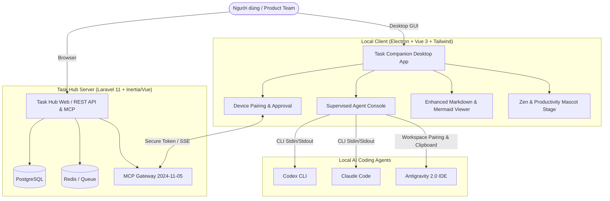

# Task Hub ⚡

[](LICENSE)
[]()
[]()
[]()
[]()
[]()

> **Task Hub** là nền tảng quản trị công việc và điều phối Supervised AI Coding Agents mã nguồn mở. Kết hợp quản lý dự án, tài liệu kỹ thuật ngữ cảnh cao (Context Packs), tích hợp giao thức MCP (Model Context Protocol), và ứng dụng desktop **Task Companion** điều phối thực thi cục bộ với **Antigravity 2.0**, **Codex**, và **Claude Code**.

---

## 🏛️ Kiến trúc tổng thể (Architecture)



---

## 📂 Cấu trúc Repository (Workspaces)

- **`apps/hub`** — Máy chủ web Laravel 11 + Inertia/Vue 3, cung cấp REST API, MCP Server, xác thực GitHub OAuth và quản lý Sprint/Project.
- **`apps/desktop`** — Ứng dụng desktop Electron (Windows) hỗ trợ giám sát Agent Console, kết nối Antigravity IDE, Pomodoro, Mascot đồng hành và hiển thị Markdown phong phú.
- **`packages/contracts`** — Hợp đồng đặc tả giao tiếp versioned OpenAPI (`task-hub.openapi.yaml`) và JSON Schemas.
- **`infra/docker`** — Cấu hình triển khai tự lưu trữ (Self-hosted) gồm PostgreSQL, Redis, Nginx, PHP-FPM worker và scheduler.
- **`docs/`** — Tài liệu kỹ thuật chi tiết về quy trình Request Discovery, kiến trúc hệ thống, QA plan và runbooks.

---

## 🚀 Hướng dẫn khởi chạy nhanh (Quick Start)

### 1. Khởi chạy Máy chủ Task Hub (Docker)

```bash
# Thiết lập biến môi trường
cp apps/hub/.env.example apps/hub/.env

# Khởi chạy cụm dịch vụ qua Docker Compose
docker compose -f infra/docker/compose.yml up -d --build

# Chạy migration cơ sở dữ liệu
docker compose -f infra/docker/compose.yml exec hub php artisan migrate --force
```

Truy cập Hub tại `http://localhost:8080`.

### 2. Khởi chạy Ứng dụng Desktop (Task Companion)

```powershell
# Cài đặt dependencies tại thư mục gốc
npm install

# Khởi chạy chế độ phát triển Desktop
npm --workspace apps/desktop run dev

# Đóng gói bộ cài đặt Windows (.exe)
npm --workspace apps/desktop run build:vue
npm --workspace apps/desktop run build
```

---

## 🤖 Điều phối Local AI Agents qua CAO

Task Companion sử dụng **AWS Labs CLI Agent Orchestrator (CAO)** làm execution và communication layer bắt buộc. Task Hub vẫn là nguồn dữ liệu chuẩn cho task, evidence và human approval; CAO quản lý supervisor/worker, MCP inter-agent messaging và session lifecycle. Khi CAO hoặc provider không khả dụng, Desktop chặn lượt chạy và hiển thị lỗi chẩn đoán; không có native fallback.

1. Cài CAO theo [hướng dẫn chính thức](https://awslabs.github.io/cli-agent-orchestrator/docs/getting-started/installation/), sau đó cài profile supervisor mặc định:

```bash
uv tool install cli-agent-orchestrator
cao install code_supervisor
cao-server
```

2. Mở Task Companion. Khi `cao` và `cao-server` hoạt động tại `localhost:9889`, mọi lần chạy mới được khởi tạo bằng `cao launch --agents code_supervisor`; follow-up và cancel được chuyển lần lượt qua `cao session send` và `cao shutdown`.
3. Các provider được map qua CAO: `codex` → `codex`, `claude_code` → `claude_code`, `antigravity` → `antigravity_cli`. Đặt `TASK_HUB_CAO_PROFILE` nếu dùng profile supervisor khác, hoặc `CAO_SERVER_PORT` khi chạy daemon ở port khác.

CAO cần một runtime có `tmux` theo yêu cầu của dự án CAO. Trên Windows, Desktop tự phát hiện `cao` trong WSL và chuyển đường dẫn worktree sang định dạng WSL; có thể chọn distro bằng `TASK_HUB_CAO_WSL_DISTRO` (mặc định là distro WSL mặc định). Cài CAO và các provider CLI trong cùng distro đó. Desktop không tự cài hoặc cấp quyền `--yolo`; cờ này chỉ được gửi sau khi người dùng đã chọn **Full access** trong Task Companion.

Mỗi provider được kiểm tra khả dụng trong chính runtime CAO trước khi launch. Nếu CAO chạy trong WSL nhưng chỉ có `agy.exe`/`claude.exe` của Windows, lượt chạy sẽ bị chặn với hướng dẫn cài provider Linux tương ứng; không chuyển sang native. Muốn Antigravity chạy qua CAO, cần cài binary Linux `agy` trong distro WSL đang dùng.

```powershell
# Kiểm tra provider CLI trong môi trường CAO:
codex --version
claude --version
agy --version
```

---

## 📝 Khả năng Markdown & Biểu đồ nâng cao

Hệ thống hỗ trợ chuẩn Markdown GFM tối ưu với:
- **GitHub Alerts:** `> [!NOTE]`, `> [!TIP]`, `> [!IMPORTANT]`, `> [!WARNING]`, `> [!CAUTION]` với icon và giao diện trực quan.
- **GFM Task Lists:** Danh sách công việc dạng checkbox `- [ ]` và `- [x]`.
- **Diff Highlighting:** Tô màu trực quan các dòng thêm (`+`) và xóa (`-`).
- **Mermaid Diagrams:** Dựng sơ đồ luồng dữ liệu, kiến trúc và sequence diagrams trực tiếp.

---

## 📄 Bản quyền & Giấy phép (License)

Dự án được phân phối theo giấy phép mã nguồn mở **Apache License, Version 2.0**.
Bản quyền thuộc về **Copyright 2026 Ma Cà Tưng (macatung.dev)**.

Xem chi tiết tại [LICENSE](LICENSE) và [NOTICE](NOTICE).

---

## 🤝 Đóng góp & Bảo mật

- **Đóng góp:** Xem [CONTRIBUTING.md](CONTRIBUTING.md) và [CODE_OF_CONDUCT.md](CODE_OF_CONDUCT.md).
- **Chính sách bảo mật:** Xem [SECURITY.md](SECURITY.md) hoặc gửi báo cáo trực tiếp đến `security@macatung.dev`.
- **Kế hoạch phát triển:** Xem [docs/ROADMAP.md](docs/ROADMAP.md).
