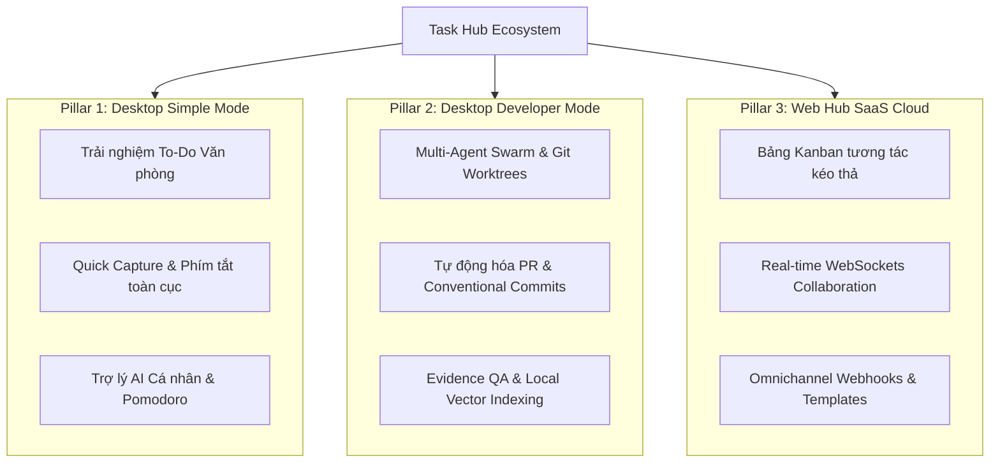

# 🗺️ Task Hub Product Roadmap & Evolution (2026 - 2027)

> **Tầm nhìn sản phẩm**: Biến Task Hub trở thành nền tảng quản lý công việc và điều phối Supervised AI Coding Agents số 1, dung hòa hoàn hảo giữa sự tinh gọn cho người dùng phổ thông (Non-tech / Văn phòng) và sức mạnh điều phối đa tác tử AI (Multi-Agent Swarm) cho các kỹ sư công nghệ.

---

## 🏛️ 3 Trụ cột Chiến lược (Three Strategic Pillars)



---

## 📅 Lộ trình Triển khai Tổng quan (Milestone Timeline)

| Giai đoạn | Thời gian | Mục tiêu trọng tâm | Quy mô Story Points |
| :--- | :--- | :--- | :--- |
| **Phase 1: Fast Capture & Focus** | **Q3 2026** | Hoàn thiện trải nghiệm ghi việc tức thì, thông báo Windows, Kanban cơ bản | **38 SP** |
| **Phase 2: Parallel Swarm & Sync** | **Q4 2026** | Chạy song song nhiều Agent trên Git Worktree, WebSockets thời gian thực | **55 SP** |
| **Phase 3: Intelligence & Ecosystem** | **Q1 2027** | Kho mẫu Template, MCP Cloud Sync, Trợ lý AI giọng nói, Docker Sandbox | **42 SP** |

---

## 📋 Chi tiết 6 Epics & 24 Tính năng Trọng điểm

### 🏢 Trụ cột 1: Desktop Simple Mode (Văn phòng & Người dùng phổ thông)

#### 🌟 Epic 1: Quick Capture & Smart Task Entry (Thu thập việc nhanh & Nhập liệu thông minh)
*Mã Epic*: `EPIC-01` · *Độ ưu tiên*: **P0** · *Mục tiêu*: Giúp người dùng ghi lại bất kỳ ý tưởng hay việc cần làm nào trong chưa đầy 3 giây mà không cần mở toàn bộ cửa sổ ứng dụng.

| ID | Mã Issue | Tên tính năng | Ưu tiên | SP | Quý | Tóm tắt chức năng | Tiêu chí nghiệm thu (Acceptance Criteria) |
|---|---|---|:---:|:---:|:---:|---|---|
| 1 | `THUB-01` | **Global Quick-Add Overlay Bar** | **P0** | 3 | Q3 2026 | Nhấn phím tắt toàn cục `Ctrl + Alt + Space` từ bất kỳ đâu trên Windows để mở thanh nhập việc nổi nhỏ gọn giữa màn hình. | - Nhấn phím tắt kích hoạt trong < 100ms.<br>- Nhấn Enter lưu việc và tự ẩn thanh.<br>- Hỗ trợ phím Esc để đóng nhanh. |
| 2 | `THUB-02` | **Vietnamese Natural Language Date Parsing** | **P0** | 5 | Q3 2026 | Tự động bóc tách ngày giờ tự nhiên từ câu gõ tiếng Việt (VD: "báo cáo tài chính chiều mai 3h", "họp phòng ban thứ 6 tuần sau"). | - Nhận diện chính xác "hôm nay", "ngày mai", thứ trong tuần, giờ cụ thể.<br>- Tự động xóa từ khóa thời gian khỏi tiêu đề task và gán vào `due_date`. |
| 3 | `THUB-03` | **Voice-to-Task Quick Dictation** | **P1** | 5 | Q1 2027 | Nút thu âm giọng nói tiếng Việt bằng Web Speech API / Whisper cục bộ để đọc tiêu đề và tự động phân tách checklist bước con. | - Nhận diện giọng nói tiếng Việt với độ chính xác > 90%.<br>- Tự nhận diện từ khóa "gạch đầu dòng" hoặc "bước tiếp theo" để tách checklist. |
| 4 | `THUB-04` | **Drag-and-Drop Reordering** | **P1** | 3 | Q3 2026 | Kéo thả mượt mà để sắp xếp lại thứ tự công việc trong danh sách và các bước con trong drawer chi tiết. | - Kéo thả trực quan bằng chuột với hiệu ứng bóng đổ mượt.<br>- Lưu trữ `sort_order` cục bộ và đồng bộ lên server. |

---

#### ⏱️ Epic 2: Daily Focus, Reminders & Habit Loops (Tập trung hàng ngày & Nhắc việc)
*Mã Epic*: `EPIC-02` · *Độ ưu tiên*: **P1** · *Mục tiêu*: Biến Task Hub thành người bạn đồng hành tăng năng suất làm việc suốt cả ngày.

| ID | Mã Issue | Tên tính năng | Ưu tiên | SP | Quý | Tóm tắt chức năng | Tiêu chí nghiệm thu (Acceptance Criteria) |
|---|---|---|:---:|:---:|:---:|---|---|
| 5 | `THUB-05` | **Native Windows Toast Reminders & Daily Briefing** | **P0** | 5 | Q3 2026 | Thông báo Windows native nhắc việc sắp đến hạn; popup tóm tắt 9:00 sáng "3 việc quan trọng nhất hôm nay". | - Gửi toast notification chuẩn Windows 10/11.<br>- Click thông báo mở ngay task chi tiết tương ứng.<br>- Tùy chỉnh giờ nhận Daily Briefing. |
| 6 | `THUB-06` | **Focus Soundscapes & Pomodoro Companion** | **P1** | 3 | Q3 2026 | Bộ đếm thời gian Pomodoro (25/5 phút) kèm âm thanh nền lofi, tiếng mưa và mascot động viên khi hoàn thành chu kỳ. | - Bộ đếm giờ có thông báo chuông khi hết phiên.<br>- Tích hợp 4 loại âm thanh nền thư giãn.<br>- Thống kê số pomodoro hoàn thành trong ngày. |
| 7 | `THUB-07` | **Recurring Tasks Engine** | **P1** | 5 | Q4 2026 | Thiết lập công việc lặp lại định kỳ (hàng ngày, ngày làm việc trong tuần, hàng tuần, hàng tháng). | - Khi hoàn thành task định kỳ, tự động tạo task chu kỳ tiếp theo.<br>- Giữ nguyên các thuộc tính ưu tiên và dự án. |
| 8 | `THUB-08` | **2-Way Calendar Sync (.ics & Google Calendar)** | **P2** | 5 | Q1 2027 | Đồng bộ 2 chiều các công việc có hạn chót với Google Calendar và Outlook qua iCal URL hoặc OAuth. | - Cung cấp feed iCal private cho mỗi tài khoản.<br>- Cập nhật hạn chót trên Google Calendar tự động đổi `due_date` trên Task Hub. |

---

### 💻 Trụ cột 2: Desktop Developer Mode & Supervised AI Agents (Kỹ sư & Điều phối Agent)

#### 🤖 Epic 3: Multi-Agent Parallel Orchestration & Swarm (Điều phối Agent Đa luồng)
*Mã Epic*: `EPIC-03` · *Độ ưu tiên*: **P0** · *Mục tiêu*: Cho phép một kỹ sư giám sát và điều phối 3-5 Agent AI làm việc song song cùng lúc mà không bị nghẽn hay xung đột.

| ID | Mã Issue | Tên tính năng | Ưu tiên | SP | Quý | Tóm tắt chức năng | Tiêu chí nghiệm thu (Acceptance Criteria) |
|---|---|---|:---:|:---:|:---:|---|---|
| 9 | `THUB-09` | **Isolated Git Worktree Parallel Runner** | **P0** | 8 | Q4 2026 | Tự động tạo nhánh và thư mục Git Worktree cô lập cho từng Agent, cho phép chạy đồng thời nhiều tính năng trên cùng một repo. | - Mỗi task chạy trên 1 worktree riêng biệt.<br>- Tự động dọn dẹp worktree khi hoàn thành task hoặc khi hủy chạy. |
| 10 | `THUB-10` | **Agent Roles Pipeline (Spec → Code → Test)** | **P0** | 8 | Q4 2026 | Pipeline phân vai tự động: Architect Agent viết đặc tả kỹ thuật → Coder Agent lập trình → QA Agent chạy kiểm thử và review code. | - Chuyển giao ngữ cảnh (context handoff) liền mạch giữa các agent.<br>- Cung cấp nút phê duyệt (Human-in-the-loop approval) trước khi chuyển bước. |
| 11 | `THUB-11` | **Extended Agent CLI Runners (Codex, Cursor, Copilot)** | **P1** | 5 | Q4 2026 | Mở rộng ngoài Antigravity và Claude Code: hỗ trợ thêm OpenAI Codex CLI, Cursor Agent CLI và GitHub Copilot CLI. | - Tự động phát hiện CLI đã cài đặt trong máy.<br>- Chuẩn hóa output stream và token telemetry thống nhất. |
| 12 | `THUB-12` | **Auto-Healing Loop & Interactive Terminal Takeover** | **P1** | 5 | Q4 2026 | Phát hiện Agent bị kẹt vòng lặp lỗi lặp đi lặp lại (> 3 lần cùng 1 lỗi) và tự động mở PTY terminal để dev can thiệp bằng tay. | - Thuật toán phát hiện lặp pattern trong log output.<br>- Tạm dừng an toàn và cấp quyền điều khiển trực tiếp cho lập trình viên. |

---

#### 🛡️ Epic 4: Evidence-Driven QA & Git Automation (Tự động hóa Kiểm thử & Git)
*Mã Epic*: `EPIC-04` · *Độ ưu tiên*: **P1** · *Mục tiêu*: Biến kết quả của AI Agent thành bằng chứng xác thực đáng tin cậy với kiểm thử tự động và Git chuẩn mực.

| ID | Mã Issue | Tên tính năng | Ưu tiên | SP | Quý | Tóm tắt chức năng | Tiêu chí nghiệm thu (Acceptance Criteria) |
|---|---|---|:---:|:---:|:---:|---|---|
| 13 | `THUB-13` | **Automated Pull Request & Conventional Commits** | **P0** | 5 | Q3 2026 | Agent tự động gom commit theo chuẩn `feat:`, `fix:`, đẩy nhánh lên GitHub/GitLab và mở Pull Request kèm bản tóm tắt thay đổi. | - Tự tạo commit message rõ ràng dựa trên nội dung diff.<br>- Tạo PR trên GitHub kèm liên kết đến Task ID của Task Hub. |
| 14 | `THUB-14` | **Visual Acceptance Criteria Auto-Verifier** | **P1** | 5 | Q4 2026 | Tự động chạy test suite hoặc linter tương ứng với từng dòng trong Acceptance Criteria và tự động tick xanh khi pass. | - Phân tích từng dòng `- [ ]` trong AC.<br>- Chạy lệnh test kiểm chứng và đổi trạng thái tự động thành `- [x]`. |
| 15 | `THUB-15` | **Local Semantic Vector Codebase Search (RAG)** | **P1** | 8 | Q1 2027 | Đánh chỉ mục vector cục bộ toàn bộ mã nguồn dự án giúp Agent tìm kiếm hàm, class và tài liệu liên quan nhanh chóng. | - Không gửi mã nguồn ra ngoài, chạy embedding cục bộ.<br>- Tìm kiếm ngữ nghĩa trả về chính xác đoạn code liên quan trong < 200ms. |
| 16 | `THUB-16` | **Docker Sandbox Isolation Runner** | **P2** | 5 | Q1 2027 | Cho phép cấu hình chạy lệnh của Agent trong một container Docker cô lập để bảo vệ máy trạm khỏi mã độc hoặc lệnh nguy hiểm. | - Khởi tạo container Docker tạm thời theo file cấu hình của project.<br>- Giới hạn tài nguyên CPU/RAM và quyền truy cập thư mục hệ thống. |

---

### 🌐 Trụ cột 3: Web Hub SaaS & Team Collaboration (Cộng tác nhóm & Đám mây)

#### 👥 Epic 5: Agile Workspaces, Kanban & Real-time Collaboration (Làm việc nhóm Thời gian thực)
*Mã Epic*: `EPIC-05` · *Độ ưu tiên*: **P0** · *Mục tiêu*: Xây dựng trải nghiệm quản trị dự án trực quan, mượt mà và kết nối thời gian thực cho cả nhóm.

| ID | Mã Issue | Tên tính năng | Ưu tiên | SP | Quý | Tóm tắt chức năng | Tiêu chí nghiệm thu (Acceptance Criteria) |
|---|---|---|:---:|:---:|:---:|---|---|
| 17 | `THUB-17` | **Interactive Drag-and-Drop Kanban Board** | **P0** | 5 | Q3 2026 | Bảng Kanban hiện đại với các cột (Backlog, To Do, In Progress, Code Review, Done), hỗ trợ kéo thả thẻ và lọc đa tiêu chí. | - Kéo thả task giữa các cột tự động cập nhật `status`.<br>- Lọc tức thì theo người phụ trách, nhãn, mức ưu tiên và sprint. |
| 18 | `THUB-18` | **Real-time Multi-User Sync (Laravel Reverb)** | **P0** | 8 | Q4 2026 | Đồng bộ thời gian thực qua WebSockets khi thành viên khác chỉnh sửa task, thêm bình luận hoặc khi Agent hoàn thành việc. | - Cập nhật giao diện của tất cả người dùng trong phòng làm việc trong < 150ms.<br>- Hiển thị badge ai đang xem hoặc chỉnh sửa task (Avatar presence). |
| 19 | `THUB-19` | **Multi-tenant Workspaces & Role-Based Access Control** | **P1** | 5 | Q4 2026 | Hỗ trợ tạo nhiều Workspace cho các tổ chức/công ty khác nhau; phân quyền chi tiết (Owner, Admin, Member, Guest/Client). | - Mỗi Workspace có không gian dữ liệu độc lập.<br>- Phân quyền chặt chẽ các hành động: tạo/xóa dự án, cấu hình webhook, xem tài chính. |
| 20 | `THUB-20` | **Activity Stream, Markdown Comments & @Mentions** | **P1** | 3 | Q3 2026 | Khung bình luận hỗ trợ định dạng Markdown, dán ảnh, tag tên đồng đội `@username` và lịch sử thay đổi (Audit Log). | - Gõ `@` hiển thị gợi ý danh sách thành viên trong dự án.<br>- Gửi thông báo cho thành viên được tag. |

---

#### 🔗 Epic 6: Ecosystem, Templates & Omnichannel Notifications (Hệ sinh thái & Tích hợp)
*Mã Epic*: `EPIC-06` · *Độ ưu tiên*: **P1** · *Mục tiêu*: Mở rộng kết nối Task Hub tới mọi công cụ giao tiếp và nền tảng của doanh nghiệp.

| ID | Mã Issue | Tên tính năng | Ưu tiên | SP | Quý | Tóm tắt chức năng | Tiêu chí nghiệm thu (Acceptance Criteria) |
|---|---|---|:---:|:---:|:---:|---|---|
| 21 | `THUB-21` | **Omnichannel Webhook & Notification Hub** | **P0** | 5 | Q3 2026 | Tích hợp gửi thông báo tức thời qua Slack, Discord, Telegram và Zalo khi có task mới, task quá hạn hoặc khi Agent cần phê duyệt. | - Gửi tin nhắn định dạng Card đẹp mắt trên Slack/Discord/Telegram.<br>- Hỗ trợ nút hành động nhanh (Approve / Reject) trực tiếp từ tin nhắn. |
| 22 | `THUB-22` | **Project Workflow Template Marketplace** | **P1** | 5 | Q1 2027 | Kho mẫu dự án có sẵn (Scrum Sprint, Content Marketing, Tuyển dụng HR, Fullstack AI Workflow) khởi tạo trong 1 click. | - Xem trước cấu trúc task và tài liệu mẫu trước khi áp dụng.<br>- Người dùng có thể xuất dự án hiện tại thành template riêng. |
| 23 | `THUB-23` | **Public Roadmap & Customer Feature Voting Portal** | **P1** | 5 | Q1 2027 | Trang lộ trình công khai cho phép khách hàng/người dùng vote tính năng mong muốn; tự động chuyển thành Task khi đạt ngưỡng vote. | - Cho phép người dùng bình chọn và để lại ý kiến đóng góp.<br>- Tự động liên kết tính năng được duyệt vào backlog nội bộ. |
| 24 | `THUB-24` | **Cloud MCP Gateway & Tool Registry Sync** | **P2** | 5 | Q1 2027 | Đồng bộ danh mục công cụ Model Context Protocol (MCP) trên Cloud, giúp cấu hình MCP trên máy tính tự động nhận diện công cụ mới. | - Đồng bộ các MCP tool servers đã kích hoạt giữa các máy tính cá nhân.<br>- Kiểm tra trạng thái kết nối và phân phối token xác thực an toàn. |

---

## 🎯 Ma trận Ưu tiên MoSCoW (Prioritization Matrix)

| Danh mục | Tiêu chí | Số lượng | Danh sách mã Issue |
| :--- | :--- | :---: | :--- |
| **Must-Have (P0)** | Bắt buộc phải có để tạo nên sự khác biệt cốt lõi và hoàn thiện trải nghiệm cơ bản | **8** | `THUB-01`, `THUB-02`, `THUB-05`, `THUB-09`, `THUB-10`, `THUB-13`, `THUB-17`, `THUB-18`, `THUB-21` |
| **Should-Have (P1)** | Tăng cường trải nghiệm vượt trội, tối ưu hóa năng suất và cộng tác nhóm sâu | **12** | `THUB-03`, `THUB-04`, `THUB-06`, `THUB-07`, `THUB-11`, `THUB-12`, `THUB-14`, `THUB-15`, `THUB-19`, `THUB-20`, `THUB-22`, `THUB-23` |
| **Could-Have (P2)** | Các tính năng mở rộng nâng cao, hệ sinh thái và tích hợp môi trường ngoài | **4** | `THUB-08`, `THUB-16`, `THUB-24` |

---

## 🚀 Hướng dẫn Nạp dữ liệu vào Hệ thống (Database Seeding)

Toàn bộ 6 Epics và 24 tính năng ở trên đã được đóng gói thành Seeder Laravel:

```bash
# Di chuyển vào thư mục backend
cd apps/hub

# Chạy seeder nạp Dự án Roadmap, 6 Epics và 24 Tasks vào cơ sở dữ liệu
php artisan db:seed --class=RoadmapFeatureSeeder
```

Sau khi chạy xong, bạn có thể xem và quản lý trực tiếp dự án này trên giao diện Web (`/projects/task-hub-roadmap-evolution`) hoặc mở trên ứng dụng Windows Desktop Task Hub.
