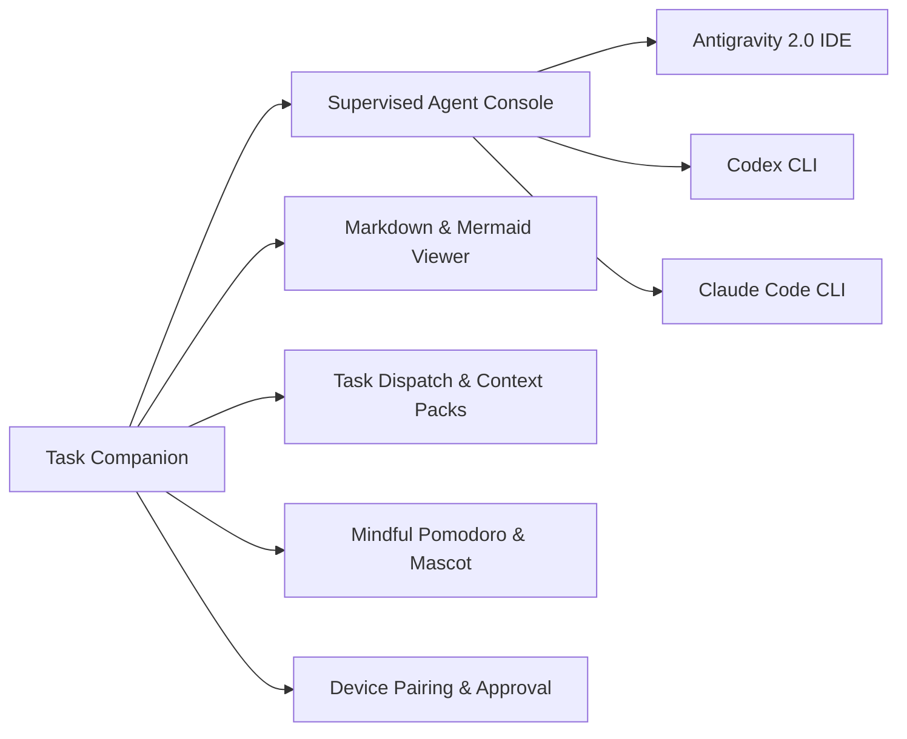

# ⚡ Task Companion — Desktop App (Windows)

[](../../LICENSE)
[]()
[]()
[]()
[]()

Ứng dụng mascot desktop chạy trên Windows, kết hợp quản lý tác vụ (Task workspace), đồng hồ Pomodoro chánh niệm, trình hiển thị Markdown/Mermaid phong phú và điều phối AI Coding Agent (Antigravity 2.0, Codex, Claude Code).

---

## ✨ Tính Năng Nổi Bật



1. **Cửa Sổ Trong Suốt Lơ Lửng (Frameless Transparent Mascot)**:
   - Mascot đồng hành hiển thị trên màn hình với nền trong suốt tuyệt đối.
   - Kéo thả tự do (`Drag & Drop`) tới bất kỳ góc màn hình nào.
   - Chế độ ghim trên cùng (`Always-on-Top`) và hệ thống chuông định kỳ thư giãn.

2. **Trung Tâm Điều Phối Tác Vụ (Task Workspace)**:
   - Đồng bộ danh sách công việc thời gian thực với Task Hub.
   - Xem và phê duyệt Request Discovery Plan từ AI.
   - Hỗ trợ ghi chú nhanh (Quick Notes), bộ đếm Pomodoro và theo dõi tiến độ công việc.

3. **Supervised AI Agent Console**:
   - Tích hợp điều khiển **Codex CLI**, **Claude Code** và **Antigravity 2.0 IDE**.
   - Với **Codex / Claude Code**: Mở console PTY cô lập, stream stdin/stdout thời gian thực, quản lý phiên và sao chép log nhanh.
   - Với **Antigravity 2.0 Desktop**: Tự động sinh file cấu hình `.agents/mcp_config.json`, đưa context pack vào clipboard và ghép nối với Antigravity Agent tools.
   - Tự động đính kèm Verification Evidence và hoàn thành Agent Handoff về Hub.

4. **Trình Render Markdown & Biểu Đồ Mermaid Tích Hợp**:
   - Hỗ trợ đầy đủ **GitHub Alerts** (`[!NOTE]`, `[!TIP]`, `[!IMPORTANT]`, `[!WARNING]`, `[!CAUTION]`).
   - Checkbox tương tác cho danh sách việc cần làm (GFM Task Lists).
   - Tô màu cú pháp cho các khối thay đổi code (Diff Highlight).
   - Render sơ đồ cấu trúc/luồng dữ liệu trực tiếp bằng **Mermaid**.

5. **Cập Nhật Tự Động (Auto-Update)**:
   - Tự động kiểm tra bản cập nhật mới trên GitHub Releases sau khi khởi động và định kỳ mỗi 6 giờ.
   - Tải bản cập nhật ngầm, chỉ áp dụng khi người dùng xác nhận khởi động lại.

---

## 🚀 Hướng Dẫn Phát Triển & Đóng Gói

### 1. Chạy chế độ Phát triển (Development):
```powershell
# Chạy từ thư mục gốc của repository
npm run dev

# Hoặc di chuyển vào thư mục apps/desktop
cd apps/desktop
npm run dev
```

`predev` và `prebuild` sẽ kiểm tra CAO trong WSL distro `Ubuntu-24.04` bằng user `rss`. Nếu chưa có `cao`/`cao-server`, script tự cài `cli-agent-orchestrator` bằng `uv` và cài profile `code_supervisor`, sau đó Electron main tự khởi động daemon ở port `9889`. Có thể đổi distro/user bằng `TASK_HUB_CAO_WSL_DISTRO` và `TASK_HUB_CAO_WSL_USER`; đặt `TASK_HUB_CAO_AUTO_INSTALL=false` nếu muốn chỉ kiểm tra mà không tự cài.

Chạy với các chế độ riêng biệt:
```powershell
npm --workspace apps/desktop run dev:ide      # Mở giao diện phát triển độc lập IDE
npm --workspace apps/desktop run dev:mascot   # Mở giao diện Mascot lơ lửng
```

### 2. Kiểm thử Unit Test:
```powershell
npm --workspace apps/desktop run test
```

### 3. Đóng gói ứng dụng Windows (.exe):
```powershell
npm --workspace apps/desktop run build
```
Bộ cài đặt `.exe` và file `latest.yml` sẽ được tạo trong thư mục `apps/desktop/release/`.

Từ thư mục gốc có thể dùng alias tương đương: `npm run desktop:package`. Prebuild sẽ chạy cùng CAO preflight trước khi electron-builder tạo installer.

---

## 🛠️ Cấu Trúc Mã Nguồn

```
apps/desktop/
├── electron/
│   ├── main.ts                     # Quản lý BrowserWindow trong suốt, Tray & IPC Handlers
│   └── preload.ts                  # Bridge API an toàn giữa Node/Electron và Vue Renderer
├── src/
│   ├── components/
│   │   ├── AgentConsoleModal.vue   # Bảng điều khiển phiên AI Agent (Terminal, Streaming & Status)
│   │   ├── MarkdownView.vue        # Trình render Markdown với GitHub Alerts & Mermaid
│   │   ├── AntigravitySkillsModal.vue # Quản lý kỹ năng và MCP Server cho Antigravity
│   │   ├── ZenMascotStage.vue      # Mascot Ma Tọa Thiền (Đài sen & Hào quang)
│   │   ├── CoderMascotStage.vue    # Mascot Ma Cà Tưng Coder
│   │   ├── DhammapadaSpeechBubble.vue # Lời nhắc chánh niệm và kệ Pháp Cú
│   │   └── SettingsModal.vue       # Cài đặt chu kỳ và tùy biến
│   ├── utils/
│   │   ├── markdown.ts             # Bộ parser Markdown mở rộng & Sanitizer DOMPurify
│   │   ├── discoveryPlan.ts        # Xử lý cấu trúc Request Discovery Plan
│   │   └── conversation.ts         # Quản lý lịch sử hội thoại Agent
│   ├── App.vue                     # Component điều phối chính
│   └── main.ts                     # Khởi tạo Vue Application
├── package.json
└── vite.config.ts
```

---

## 📄 Bản Quyền & Giấy Phép

Phát hành theo giấy phép **Apache License, Version 2.0**.
Bản quyền © 2026 **Ma Cà Tưng (macatung.dev)**.
