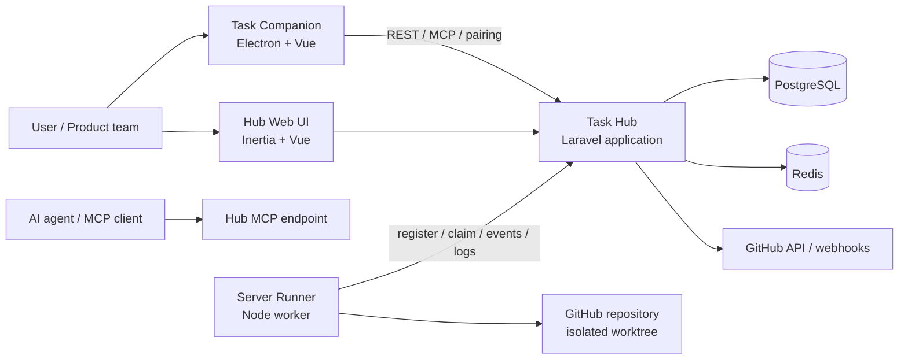
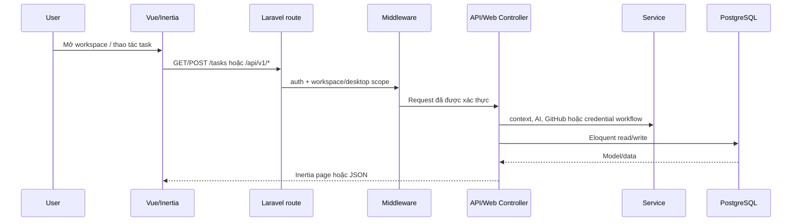
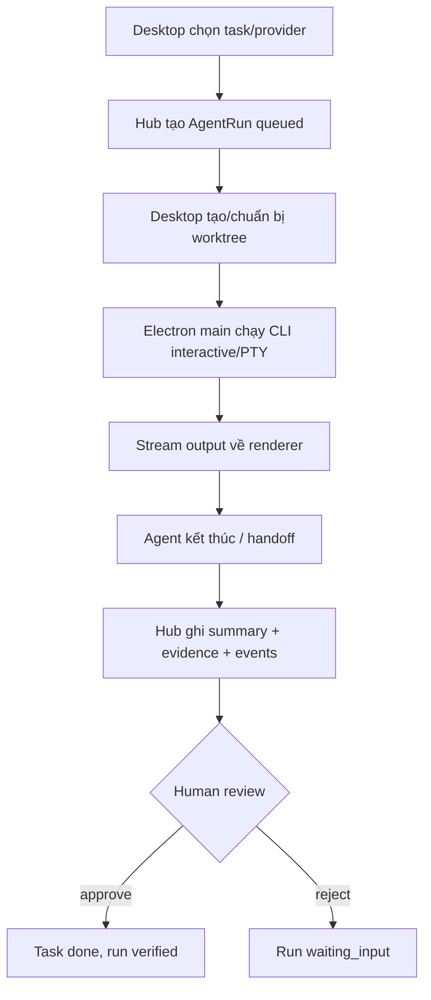
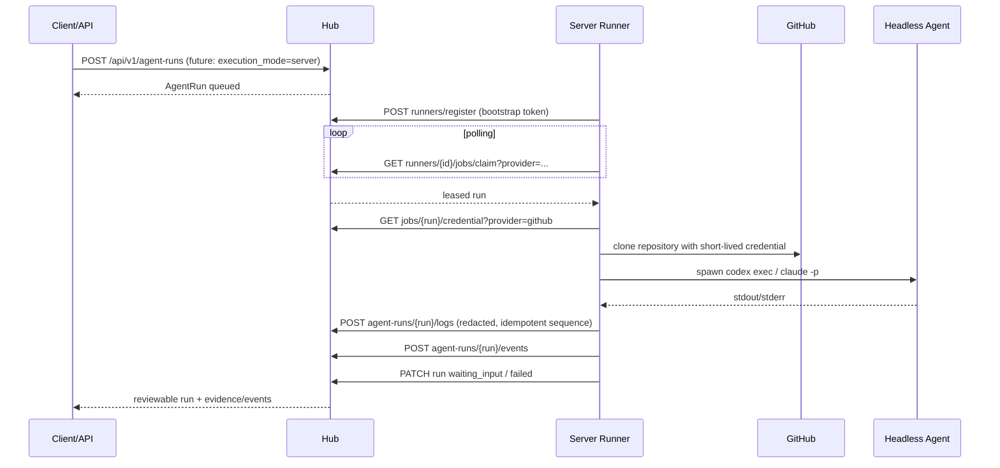

# Task Hub — Kiến trúc hiện tại

> Tài liệu này mô tả trạng thái code hiện có trong repository tại thời điểm quét ngày 2026-08-21. Đây là tài liệu architecture-as-is, không phải kiến trúc mục tiêu.

## 1. Tổng quan

Task Hub là monorepo gồm bốn phần chính:

- `apps/hub`: Laravel 11 + Inertia/Vue 3, cung cấp web UI, REST API, MCP endpoint, SaaS workspace, GitHub integration và desktop pairing.
- `apps/desktop`: Electron + Vue 3, Task Companion chạy trên máy người dùng; quản lý agent CLI, Git worktree, credential cục bộ, đồng bộ task và cache offline.
- `apps/runner`: Node.js worker server-side được giữ làm capability cho giai đoạn sau; hiện chưa được bật trong sản phẩm/deployment mặc định.
- `packages/contracts`: OpenAPI và JSON Schema dùng làm hợp đồng giao tiếp giữa các thành phần.



## 2. Repository topology

```text
task-hub/
├─ apps/
│  ├─ hub/                 Laravel backend + Inertia/Vue frontend
│  │  ├─ app/
│  │  │  ├─ Http/Controllers/   web, admin, API, Theravada
│  │  │  ├─ Middleware/         auth, workspace, desktop project, analytics
│  │  │  ├─ Models/             24 Eloquent models
│  │  │  ├─ Services/           domain/application services
│  │  │  └─ Console/Commands/   import, agent workflow, scheduled report
│  │  ├─ database/              migrations, seeders, factories
│  │  ├─ resources/js/          Vue pages, layouts, composables, types
│  │  └─ routes/                web.php, console.php
│  ├─ desktop/              Electron main/preload + Vue renderer
│  └─ runner/               Deferred server worker + provider adapter
├─ packages/contracts/      OpenAPI + JSON Schema
├─ infra/docker/            hub, worker, scheduler, postgres, redis
└─ docs/                    roadmap, operations, this document
```

Root npm workspaces hiện gồm `apps/desktop`, `apps/hub`, `apps/runner`. `packages/contracts` được validate bằng script riêng, chưa được khai báo như npm workspace.

## 3. Các layer xử lý

### Layer 1 — Presentation / client

**Hub web**

- Vue pages tại `apps/hub/resources/js/Pages` và layouts tại `resources/js/Layouts`.
- Inertia là cầu nối từ Laravel controller sang Vue page.
- Vite build frontend; TailwindCSS và các component/composable xử lý presentation state.

**Desktop renderer**

- `apps/desktop/src/App.vue` và các component modal/widget là UI Task Companion.
- `useTaskSync.ts` giữ state task/project, gọi Desktop API, cache vào `localStorage`, và fallback offline.

### Layer 2 — Transport / interface

- Web routes: `apps/hub/routes/web.php` phục vụ landing, workspace, OAuth GitHub, MCP và pairing approval UI.
- REST API: cùng file route đăng ký dưới cả `/api/*` và `/api/v1/*`.
- MCP: JSON-RPC POST tại `/mcp` và các alias `/api/mcp`, `/api/tasks/mcp`, `/api/v1/mcp`.
- Desktop API: nhóm `/api/v1/desktop/*`, xác thực bằng bearer credential + `X-Task-Hub-Project`.
- Runner API: register, heartbeat, claim job, credential, event, log, cancel.
- Electron preload (`apps/desktop/electron/preload.ts`) giới hạn renderer vào các IPC capability được expose.

### Layer 3 — Middleware / security boundary

Bootstrap Laravel đăng ký các middleware chính:

- `auth`: browser/session authentication cho các endpoint SaaS.
- `workspace` → `ResolveWorkspace`: resolve tenant hiện hành và lọc theo workspace.
- `desktop.project` → `AuthenticateDesktopProject`: xác thực desktop token/project scope.
- `admin.auth`: bảo vệ khu vực CMS/admin.
- `HandleInertiaRequests`, `TrackVisitorAnalytics`: web cross-cutting concerns.

CSRF được bỏ qua cho `api/*` và `api/v1/*` vì API dùng bearer/device credential thay cho browser CSRF cookie.

### Layer 4 — Controller / application orchestration

Controller nhận request, validate input, kiểm tra scope và điều phối model/service:

- `ApiTaskController`, `ApiProjectController`, `ApiSprintController`: CRUD và workflow task/project/sprint.
- `ApiAgentRunController`: tạo run, lifecycle, event, evidence, handoff, approve/reject, GitHub webhook.
- `ApiAgentRunnerController`: runner registration, auth, claim lease, credential delivery, logs/events/cancel.
- `TaskHubMcpController`: expose capability/context/task operations qua MCP.
- `WorkspaceController`, `WorkspaceCredentialController`, `DesktopPairingController`: tenancy, secret và pairing.
- Controller web/admin/Theravada: render page và CMS/content concerns.

### Layer 5 — Domain/application services

Các service hiện có nằm trong `apps/hub/app/Services`:

- `WorkspaceContext`: resolve workspace/tenant theo request.
- `TaskHubContextPackService`: tạo context pack cho agent run/MCP.
- `SmartProjectBreakdownService`: AI-assisted breakdown task/project.
- `OpenAiCompatiblePlanningProvider`: gọi planning provider tương thích OpenAI.
- `GithubOAuthService`, `GithubProjectIntegrationService`: OAuth, repository metadata, sync và webhook secret.
- `CredentialVaultService`: mã hóa/giải mã credential và cấp secret theo run.
- `ProjectKnowledgeService`: project documents/knowledge context.
- `WeeklyTaskReportService`: tổng hợp và gửi weekly report.

Đây là layer chứa phần lớn nghiệp vụ tích hợp. Một số workflow vẫn được orchestration trực tiếp trong controller, đặc biệt lifecycle `AgentRun` và xử lý GitHub webhook.

### Layer 6 — Persistence / data model

Eloquent models và migrations là nguồn dữ liệu chính. Nhóm dữ liệu quan trọng:

- Tenancy: `Workspace`, `User`, `WorkspaceCredential`.
- Work management: `Project`, `Task`, `Sprint`, `ProjectDocument`, `TaskDocument`, `ProjectRelease`.
- Agent execution: `AgentRunner`, `AgentRun`, `AgentRunEvent`, `AgentRunLog`, `VerificationEvidence`, `TaskUsageEvent`.
- GitHub/CMS/analytics: `GithubEvent`, `Article`, `Experience`, `Skill`, `SiteSetting`, `AnalyticsEvent`, `PageView`, `ContactSubmission`.

Database production được cấu hình cho PostgreSQL; Docker topology cung cấp PostgreSQL 16 và Redis 7. Migrations vẫn hỗ trợ các driver PHP cần thiết trong image, gồm SQLite/MySQL/PostgreSQL.

### Layer 7 — Runtime / infrastructure

- `hub`: PHP-FPM + Nginx + Supervisor trong một image production; phục vụ Laravel và asset build.
- `worker`: `php artisan queue:work`.
- `scheduler`: `php artisan schedule:work`; hiện có weekly report chạy hourly với `withoutOverlapping`.
- `apps/runner` chưa tham gia deployment hiện tại. Server-side execution được feature-flag ở Hub và chỉ dành cho một release sau.
- `postgres`: lưu trữ lâu dài.
- `redis`: cache/queue backend và persistent append-only volume.

## 4. Luồng xử lý chính

### 4.1. Web task/workspace



### 4.2. Desktop pairing và sync

1. Desktop gọi `/api/v1/capabilities` để kiểm tra tương thích.
2. Desktop bắt đầu pairing qua `/api/v1/desktop/pairing/start`.
3. User duyệt pairing trên Hub web; desktop poll status.
4. Token/project/workspace credential được lưu bằng Electron `safeStorage` tại user data.
5. `useTaskSync` gọi `/api/v1/desktop/projects` và `/api/v1/desktop/tasks` với bearer token và project header.
6. Task được cache ở `localStorage`; khi Hub không reachable, UI dùng cache và đánh dấu offline.

### 4.3. Agent run — desktop mode



Electron main có guardrail worktree và hook chặn push; `antigravity` là external session trên desktop.

### 4.4. Agent run — server mode (để dành cho giai đoạn sau)

Luồng này hiện không được cung cấp cho người dùng và không có trong `infra/docker/compose.yml`. Code/API contract vẫn được giữ để tránh mất hướng mở rộng sau này; `TASK_HUB_SERVER_RUNNER_ENABLED` mặc định là `false`.



Runner `antigravity` không được thực thi headless; provider này được đánh dấu `external_only`.

### 4.5. MCP và context pack

MCP client gọi endpoint `/mcp` với JSON-RPC. Hub controller xác thực request, expose các capability/task/context operations, và `TaskHubContextPackService` gom context từ task/project/documents/GitHub metadata để gửi cho agent. Desktop cũng gọi MCP thông qua Electron main thay vì để renderer tự quản lý secret.

## 5. Trạng thái AgentRun

Các status được khai báo trong `ApiAgentRunController`:

```text
queued → claimed → preparing → running → waiting_input → needs_review → verified
                         └──────────────→ failed
                         └──────────────→ cancelled
```

Một run chỉ được approve khi có verification evidence trạng thái `passed`. Handoff tạo evidence cho từng test và chuyển run sang `needs_review`; human approve mới chuyển task sang `done` và run sang `verified`.

## 6. Hợp đồng và versioning

- REST/MCP compatibility được mô tả trong `packages/contracts/task-hub.openapi.yaml`.
- Runner registration được validate bởi `schemas/agent-runner.schema.json` (future capability, chưa bật).
- Structured agent handoff được mô tả bởi `schemas/agent-handoff.schema.json`.
- Hub hỗ trợ đồng thời `/api/*` và `/api/v1/*`; `/api/v1` là canonical contract mới, còn route không version vẫn tồn tại cho desktop/legacy compatibility.
- Root scripts: `npm run build`, `npm run desktop:typecheck`, `npm run contracts:validate`, `npm run runner:test`.

## 7. Bảo mật và cô lập

- Workspace/tenant scope được kiểm tra ở middleware và controller; test `SaasTenantIsolationTest` kiểm chứng cross-tenant access.
- Workspace credential, GitHub OAuth token và webhook secret không lưu plaintext; service vault/`Crypt` được dùng để mã hóa.
- Runner token chỉ lưu hash trong database; token cấp lúc registration.
- Runner nhận credential scoped theo run, dùng askpass tạm thời cho Git clone, rồi xóa file askpass.
- Runner log được redact bearer/token/API key/password/secret và hỗ trợ idempotency theo sequence/event id.
- Desktop credential lưu bằng OS `safeStorage`; renderer chỉ truy cập qua preload IPC.
- Runner container chạy non-root, read-only, `cap_drop: ALL`, `no-new-privileges`, tmpfs và resource limits.
- Agent workflow có worktree riêng và pre-push guardrail yêu cầu human approval cho push.

## 8. Kiểm thử đang có

- Hub PHP Feature tests: tenancy isolation, desktop pairing, server runner, agent workflow, GitHub OAuth/integration, security hardening, admin/CMS.
- Hub TypeScript tests: component, unit, integration và E2E scenarios; test desktop runtime đọc/kiểm tra source Electron.
- Runner Node tests: provider command mapping và runner behavior.
- Contract validation: `packages/contracts/validate.mjs`.

## 9. Nhận xét kiến trúc hiện tại

### Điểm mạnh

- Ranh giới deployment rõ: Hub, Desktop và Server Runner có thể phát hành độc lập.
- Agent execution có lifecycle, event log, evidence và human approval thay vì chỉ chạy command một lần.
- Multi-tenant và credential scoping đã được đưa vào model/API.
- Có contract versioning, MCP capability discovery và test coverage cho các workflow rủi ro cao.
- Desktop có offline cache; local agent execution không cần Task Hub lưu model API key.

### Điểm cần lưu ý khi phát triển tiếp

- `routes/web.php` hiện chứa cả web routes, MCP và toàn bộ API registration; nên tách `routes/api.php`/MCP route nếu quy mô tiếp tục tăng.
- Một số nghiệp vụ agent/GitHub lifecycle vẫn nằm trực tiếp trong controller; có thể đưa vào application service/command để giảm coupling và dễ test.
- API legacy không version và `/api/v1` đang đăng ký song song; cần một policy deprecation rõ để tránh behavior drift.
- Desktop sync hiện optimistic và cache local; create/update lỗi chỉ log cảnh báo, chưa có durable retry queue hoặc conflict resolution.
- Server runner/polling là capability để dành; chỉ nên bật khi có nhu cầu server-side execution và policy billing/credential rõ ràng.
- `apps/hub` có nhiều feature content/portfolio/Theravada bên cạnh core task/agent domain; nếu tiếp tục mở rộng nên tách bounded context/module rõ hơn.

## 10. Các file bắt đầu đọc code

- Backend bootstrap/routes: `apps/hub/bootstrap/app.php`, `apps/hub/routes/web.php`, `apps/hub/routes/console.php`.
- Agent lifecycle: `apps/hub/app/Http/Controllers/Api/ApiAgentRunController.php`.
- Server runner protocol: `apps/hub/app/Http/Controllers/Api/ApiAgentRunnerController.php` và `apps/runner/src/index.mjs`.
- Context/credential/GitHub: `apps/hub/app/Services/TaskHubContextPackService.php`, `CredentialVaultService.php`, `GithubProjectIntegrationService.php`.
- Desktop bridge/runtime: `apps/desktop/electron/main.ts`, `apps/desktop/electron/preload.ts`, `apps/desktop/src/composables/useTaskSync.ts`.
- API contract: `packages/contracts/task-hub.openapi.yaml` và `packages/contracts/schemas/`.
- Deployment: `infra/docker/compose.yml`, `apps/hub/Dockerfile`, `apps/runner/Dockerfile`.
