# Task Hub Functional Specification Document (FSD)

**Document Code**: `DOC-FSD-001`  
**Version**: 2.2.0  
**Status**: Living Document / Active Maintenance  
**Standard**: `task-hub-docs-v1`  
**Canonical Manifest**: [`docs/PROJECT_DOCUMENTS.md`](file:///d:/Work/task-hub/docs/PROJECT_DOCUMENTS.md)  
**Parent Requirements**: [`docs/PRD.md`](file:///d:/Work/task-hub/docs/PRD.md), [`docs/FRD.md`](file:///d:/Work/task-hub/docs/FRD.md)  
**System Architecture**: [`docs/ARCHITECTURE.md`](file:///d:/Work/task-hub/docs/ARCHITECTURE.md)  
**Quality Assurance Plan**: [`docs/QA_PLAN.md`](file:///d:/Work/task-hub/docs/QA_PLAN.md)

---

## 1. Document Control & Living Specification Protocol

Tài liệu **Functional Specification Document (FSD)** này đặc tả toàn bộ hành vi chức năng (Functional), tiêu chuẩn phi chức năng (Non-Functional), giao diện API, sơ đồ luồng dữ liệu (Mermaid Diagrams) và quy tắc nghiệp vụ chi tiết của hệ sinh thái Task Hub.

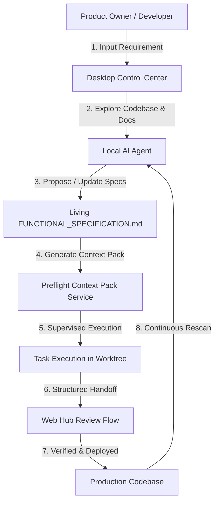

### Cơ Chế Tự Động Cập Nhật Trong Quá Trình Làm Việc Với AI (Living Spec Protocol)
1. **AI Requirement Discovery Loop**: Khi người dùng nhập yêu cầu mới vào [`WorkflowPanel.vue`](file:///d:/Work/task-hub/apps/desktop/src/components/control-center/WorkflowPanel.vue), AI đọc `FUNCTIONAL_SPECIFICATION.md` hiện tại để phân tích tác động và đề xuất bổ sung các chức năng/task mới.
2. **AI Repository Docs Scanner**: Lệnh **Scan & generate docs** trên Desktop app ([`ControlCenter.vue`](file:///d:/Work/task-hub/apps/desktop/src/views/ControlCenter.vue#L276)) tự động rà soát toàn bộ source code trong Git worktree cô lập và cập nhật lại các đặc tả trong tài liệu này cùng các biểu đồ đi kèm.
3. **Preflight Agent Ingestion**: Trước mỗi lượt chạy, [`TaskHubContextPackService.php`](file:///d:/Work/task-hub/apps/hub/app/Services/TaskHubContextPackService.php) đóng gói nội dung mới nhất của FSD vào **Context Pack**.
4. **Staleness & Verification Engine**: [`ProjectKnowledgeService.php`](file:///d:/Work/task-hub/apps/hub/app/Services/ProjectKnowledgeService.php) theo dõi SHA-256 hash và mốc thời gian `last_verified_at`. Nếu tài liệu quá 30 ngày chưa được xác thực, hệ thống tự động gắn cờ `is_stale = true` và cảnh báo trên Web Hub.

---

## 2. System Architecture & High-Level Data Flow

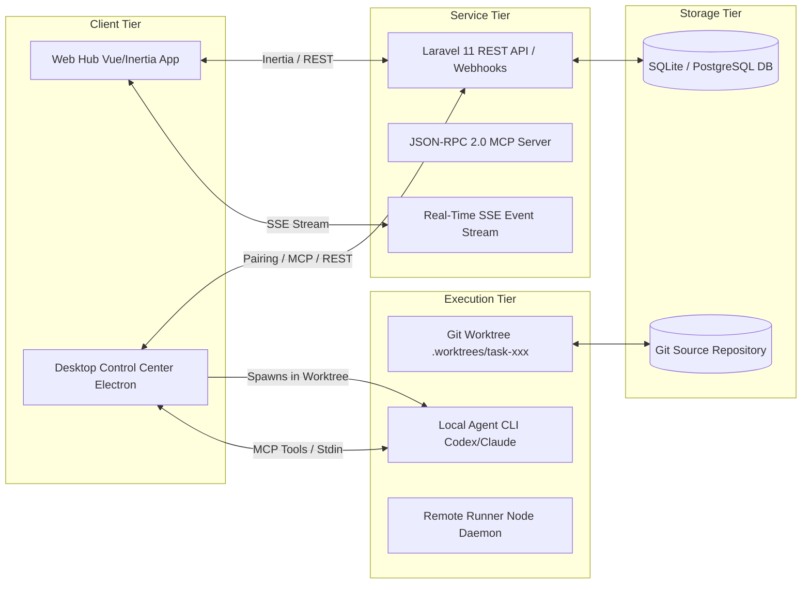

---

## 3. Detailed Functional Specifications (FS)

### Phân Hệ 1: Multi-Tenancy & Access Control (FS-01)

#### `FN-WS-01: Multi-Tenant Workspace Resolution`
- **Mục tiêu**: Đảm bảo mọi request được phân vùng dữ liệu an toàn theo workspace.
- **Trigger**: Mọi HTTP request gửi tới API.
- **Input**: Session Cookie hoặc Header `X-Workspace-Id` / Bearer Token.
- **Output**: Instance `Workspace` tương ứng hoặc HTTP 404/403.
- **Main Sequence**:
  1. [`WorkspaceContext`](file:///d:/Work/task-hub/apps/hub/app/Services/WorkspaceContext.php) đọc workspace ID từ session hoặc token.
  2. Truy vấn `Workspace` từ database và gán vào request context.
  3. Mọi query Eloquent tự động append `where('workspace_id', $workspace->id)`.
- **Linked Task**: `TASK-WS-01` | **Test Suite**: `SaasTenantIsolationTest.php`

#### `FN-WS-02: Desktop Companion Pairing & Scoped Token`
- **Mục tiêu**: Kết nối Desktop App với Web Hub an toàn bằng mã Pairing 6 chữ số.
- **Sequence Diagram**:
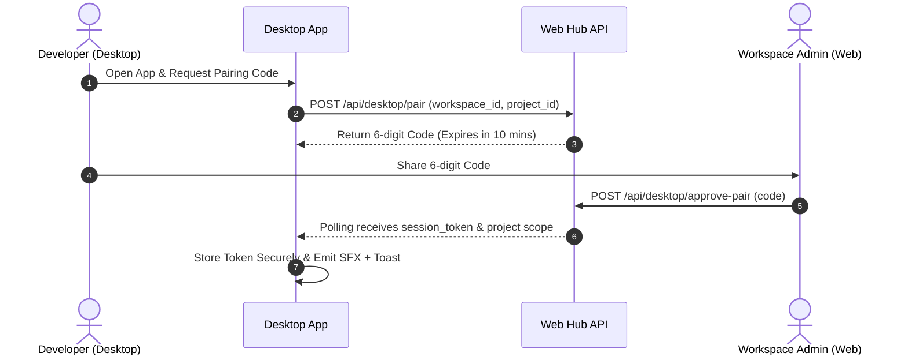
- **Linked Task**: `TASK-DESK-01` | **Test Suite**: `DesktopAgentRuntimeTest.test.ts`

---

### Phân Hệ 2: Agile Work Items & DAG Dependency Guardrails (FS-02)

#### `FN-TASK-01: Hierarchical Work Item Management (Epic -> Story -> Task -> Bug)`
- **Mục tiêu**: Quản lý cấu trúc công việc phân cấp chuẩn Agile/Scrum.
- **Quy tắc nghiệp vụ**:
  - `Epic`: Không gán trực tiếp vào sprint; chứa nhiều Story/Task.
  - `Story`, `Task`, `Bug`: Có thể gán vào Sprint, hỗ trợ điểm Story Point Fibonacci (1, 2, 3, 5, 8, 13, 21), Pomodoro ước tính và mức độ rủi ro (`low`, `medium`, `high`, `critical`).
  - Tự động sinh mã `issue_key` theo prefix của Project (ví dụ `HUB-101`).

#### `FN-TASK-02: DAG Task Dependency & Blocker Engine`
- **Mục tiêu**: Ngăn chặn thực thi các task khi nhiệm vụ tiên quyết chưa hoàn thành.
- **Logic Kiểm Tra**:
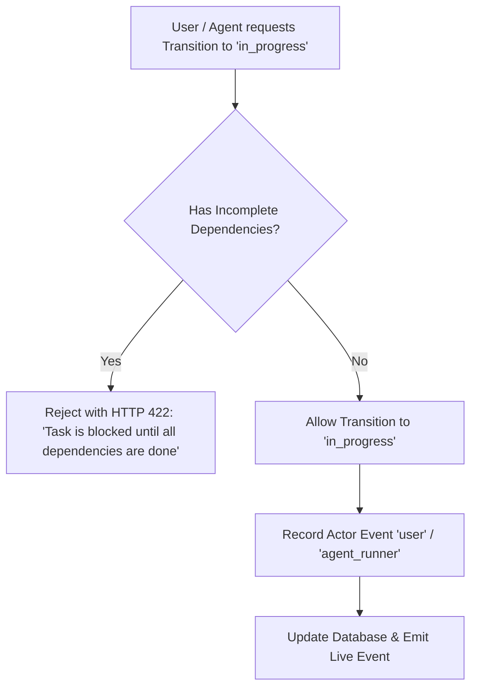
- **Linked Task**: `TASK-CORE-03` | **Test Suite**: `TaskE2EHistoryAuditTest.test.ts`

#### `FN-TASK-03: Task State Machine & Transition Matrix`
- **State Transition Diagram**:
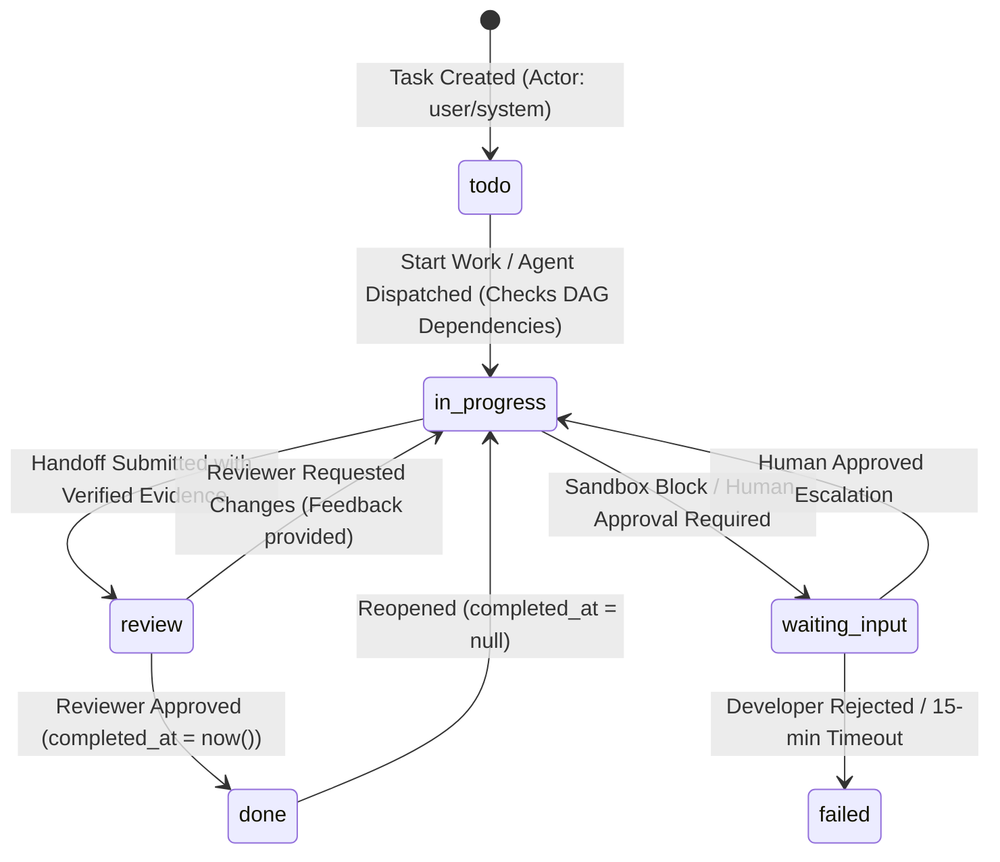
- **Linked Task**: `TASK-CORE-02` | **Test Suite**: `UiButtonWorkflowE2ETest.test.ts`

---

### Phân Hệ 3: Project Knowledge & Document Freshness Engine (FS-03)

#### `FN-DOC-01: Manifest Document Registry (`docs/PROJECT_DOCUMENTS.md`)`
- **Mục tiêu**: Bảng mục lục trung tâm quản lý 6 loại tài liệu cốt lõi: `brief`, `prd`, `functional_spec`, `architecture`, `qa_plan`, `release_runbook`.
- **Parsing Logic**: Đọc bảng markdown định dạng `| type | title | path_or_url | owner | version | tags |` và đồng bộ vào bảng `project_documents`.

#### `FN-DOC-02: 30-Day Freshness Verification Engine`
- **State Diagram**:
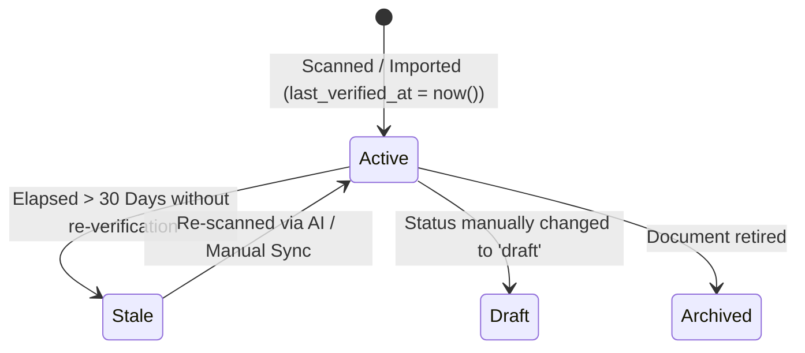
- **Linked Task**: `TASK-DOC-02` | **Test Suite**: `ProjectDocumentsWorkflowE2ETest.test.ts`

#### `FN-DOC-03: Preflight Context Pack Ingestion`
- **Mục tiêu**: Đóng gói nội dung tài liệu mới nhất vào context của Agent trước khi chạy task.
- **Source Paths**: [`TaskHubContextPackService.php`](file:///d:/Work/task-hub/apps/hub/app/Services/TaskHubContextPackService.php)

---

### Phân Hệ 4: Desktop Control Center & Agent Orchestration (FS-04)

#### `FN-DESK-01: Isolated Git Worktree Provisioning`
- **Mục tiêu**: Đảm bảo Agent chỉ thao tác trong thư mục worktree cô lập `.worktrees/task-KEY`.
- **Main Sequence**:
  1. Desktop gọi `git worktree add -b task/KEY-title .worktrees/task-KEY main`.
  2. Thiết lập đường dẫn làm việc của AI Agent tại worktree cô lập.
  3. Sau khi hoàn tất hoặc hủy, tự động dọn dẹp worktree an toàn.

#### `FN-DESK-02: Multi-Tier Execution Policy & Human Escalation`
- **Sequence Diagram**:
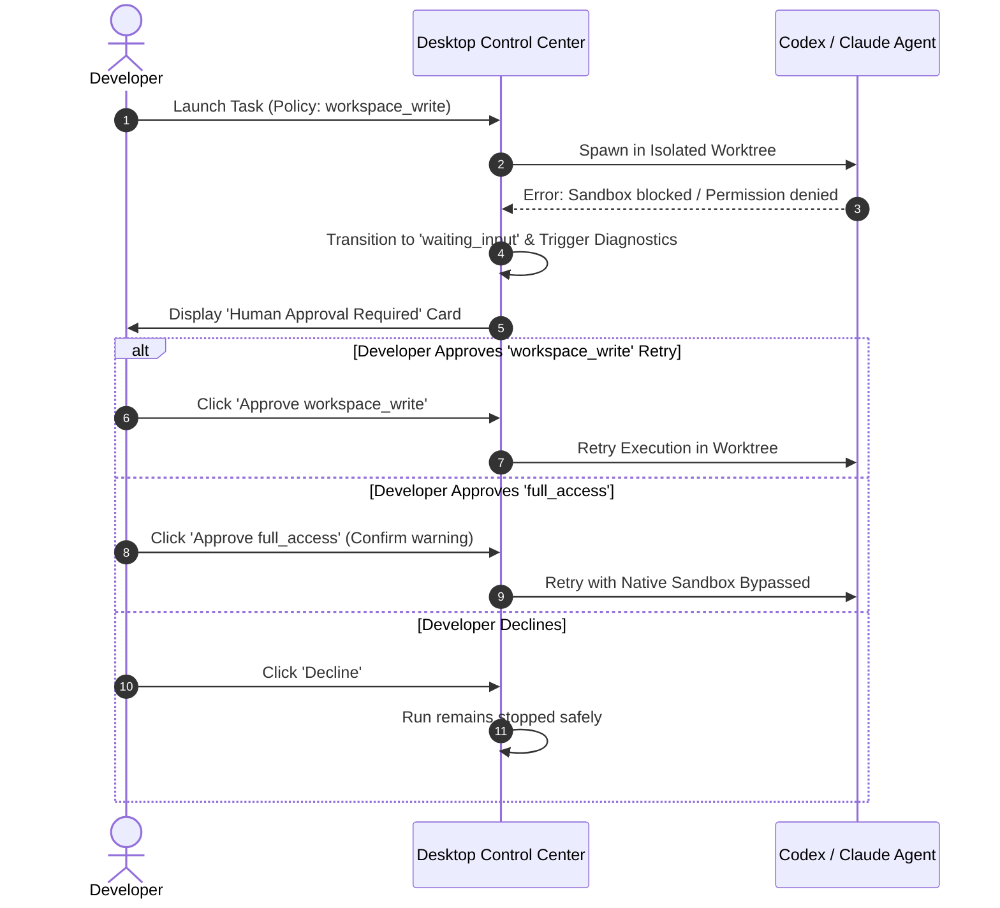
- **Linked Task**: `TASK-DESK-03` | **Test Suite**: `UserInTheLoopE2E.test.ts`

#### `FN-DESK-03: Instant User Action Feedback & SFX Cues`
- **Mục tiêu**: Cung cấp phản hồi thị giác (Floating Toast) và thính giác (Web Audio SFX) ngay khi người dùng thao tác.
- **Source Paths**: [`useActionFeedback.ts`](file:///d:/Work/task-hub/apps/desktop/src/composables/useActionFeedback.ts), [`ActionFeedbackToast.vue`](file:///d:/Work/task-hub/apps/desktop/src/components/ActionFeedbackToast.vue)

#### `FN-DESK-04: Background Context Pack Prefetching & Local Cache Engine`
- **Mục tiêu**: Tự động đồng bộ ngầm Context Pack về bộ nhớ đệm cục bộ (Local Storage & Reactive Memory Cache) ngay khi người dùng chọn Workspace, load danh sách task hoặc chọn task, giúp khởi chạy Agent gần như tức thì (0ms network wait) nhưng vẫn đảm bảo tính tươi mới 100%.
- **Cơ chế hoạt động**:
  1. **Background Prefetch Queue**: Khi tải task queue hoặc chuyển workspace, hệ thống tự động tải ngầm Context Pack cho các task `in_progress`, `todo`, `review`.
  2. **Instant Cache Launch**: Khi bấm "Launch agent", hệ thống kiểm tra cache cục bộ. Nếu fresh (khớp `updated_at` và trong TTL), Agent khởi chạy ngay lập tức; đồng thời kích hoạt revalidation ngầm.
  3. **Event-driven Invalidation**: Khi tài liệu trong repo được lưu (`saveDocs`) hoặc đồng bộ (`syncDocs`), toàn bộ cache được invalidate tự động để đảm bảo dữ liệu mới nhất.
- **Sequence Diagram**:
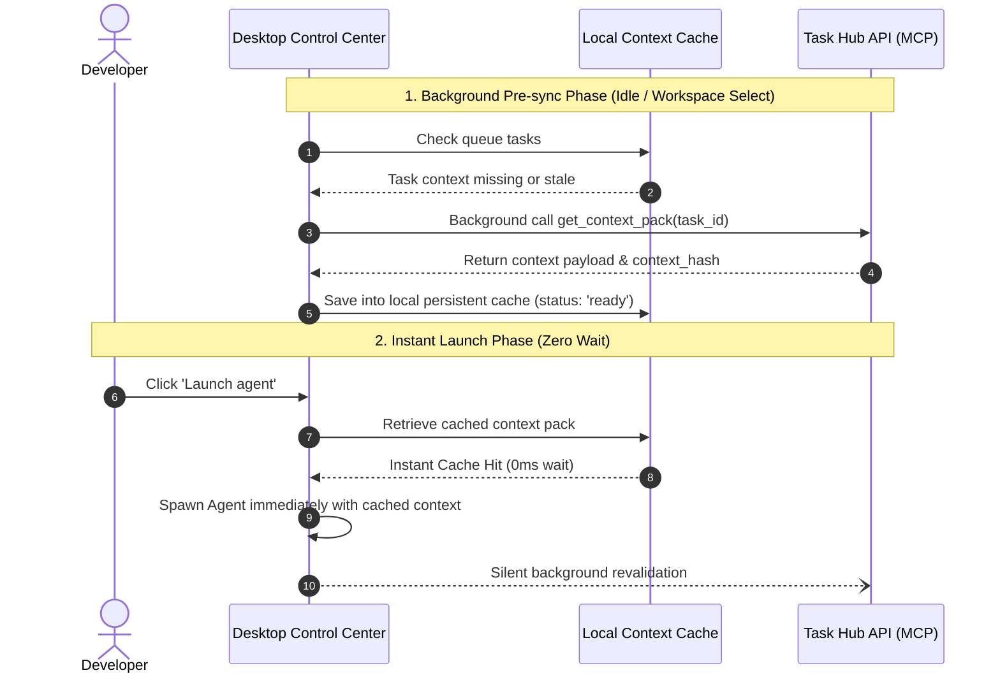
- **Source Paths**: [`useContextPackCache.ts`](file:///d:/Work/task-hub/apps/desktop/src/composables/useContextPackCache.ts), [`ControlCenter.vue`](file:///d:/Work/task-hub/apps/desktop/src/views/ControlCenter.vue#L156)
- **Linked Task**: `TASK-PERF-01` | **Test Suite**: `useContextPackCache.test.ts`, `ControlCenterContextPackOptimization.test.ts`

---

### Phân Hệ 5: Structured Handoff, Verification Evidence & Review Flow (FS-05)

#### `FN-HAND-01: Strict JSON Schema Handoff Contract`
- **Schema Validation**: Bắt buộc tuân thủ [`agent-handoff.schema.json`](file:///d:/Work/task-hub/packages/contracts/schemas/agent-handoff.schema.json) với `run_id`, `summary`, `changed_files` (>= 1), `tests` (>= 1).

#### `FN-HAND-02: Reviewer Workflow Sequence`
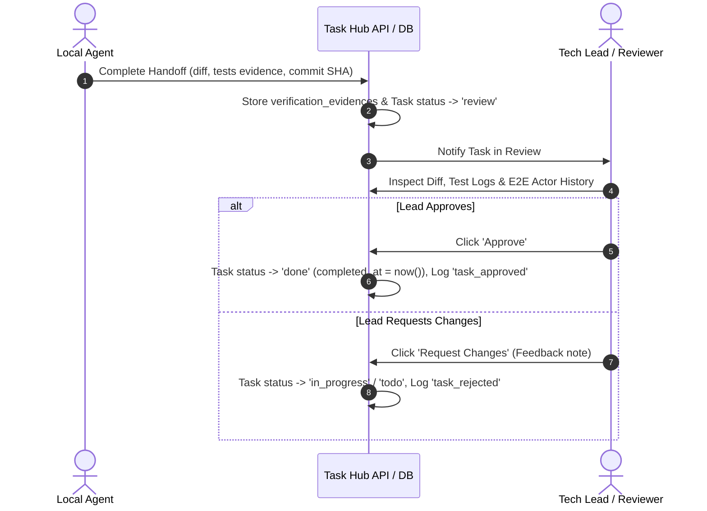
- **Linked Task**: `TASK-HAND-03` | **Test Suite**: `diffHandoff.test.ts`, `UserInTheLoopE2ETest.test.ts`

---

### Phân Hệ 6: E2E Task History Audit Trail & Actor Attribution (FS-06)

#### `FN-AUDIT-01: Complete Event Aggregation`
- **Mục tiêu**: Thu thập toàn bộ các sự kiện từ `TaskUsageEvent`, `AgentRun`, `VerificationEvidence` thành dòng thời gian E2E hợp nhất.

#### `FN-AUDIT-02: Multi-Type Actor Attribution`
- Phân định rõ ràng:
  - `👤 user`: Con người (Developer, Reviewer, Approver).
  - `🤖 agent_runner`: Desktop Companion / Headless Agent Runner.
  - `🧠 agent_model`: Mô hình LLM (Codex, Claude, Antigravity).
  - `🐙 github_ci`: GitHub Webhooks & CI/CD.
  - `⚙️ system`: Cronjob & System Automations.

#### `FN-AUDIT-03: 1-Click Markdown Audit Report Export`
- Tạo báo cáo nghiệm thu chuyên nghiệp dạng Markdown sao chép trực tiếp vào Clipboard ([`TaskHistoryTimeline.vue`](file:///d:/Work/task-hub/apps/hub/resources/js/Components/tasks/TaskHistoryTimeline.vue#L165)).

---

### Phân Hệ 7: AI Requirement Discovery & Backlog Generator (FS-07)

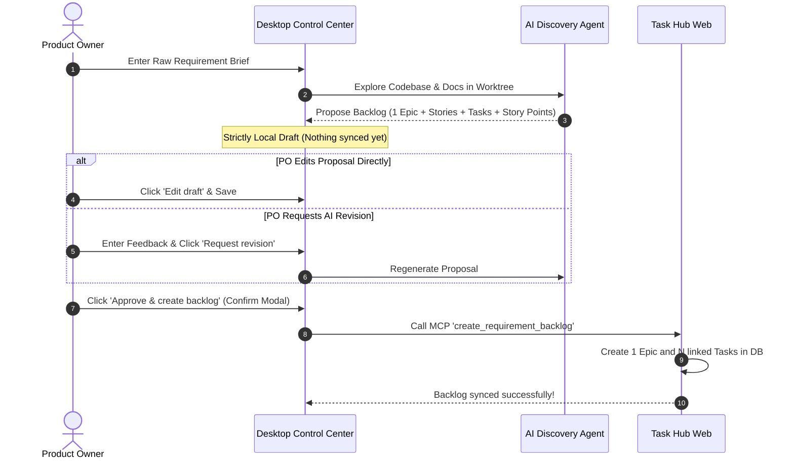
- **Linked Task**: `TASK-REQ-01` | **Test Suite**: `discoveryPlan.test.ts`, `WorkflowPanelReview.test.ts`

---

## 4. Detailed Non-Functional Specifications (NFR)

```
                              ┌────────────────────────────────────────────────────────┐
                              │            NON-FUNCTIONAL REQUIREMENTS (NFR)           │
                              └───────────────────────────┬────────────────────────────┘
                                                          │
       ┌──────────────────────┬───────────────────────────┼───────────────────────────┬──────────────────────┐
       ▼                      ▼                           ▼                           ▼                      ▼
┌──────────────────┐  ┌──────────────────┐       ┌───────────────────┐       ┌───────────────────┐  ┌──────────────────┐
│ NFR-01: Security │  │ NFR-02: Safety & │       │ NFR-03: Low-      │       │ NFR-04: Living    │  │ NFR-05: 100%     │
│ & Token Redact   │  │ Fail-Closed (15m)│       │ Latency Streaming │       │ Spec Continuous   │  │ Traceability &   │
│                  │  │                  │       │ (<100ms)          │       │ AI Synchronization│  │ Test Coverage    │
└──────────────────┘  └──────────────────┘       └───────────────────┘       └───────────────────┘  └──────────────────┘
```

### `NFR-01: Security, Secret Redaction & Token Masking`
- **Yêu cầu**: Tự động lọc bỏ (redact) toàn bộ token, khóa bảo mật trước khi xuất ra log hoặc SSE stream.
- **Quy tắc**:
  - Mask Bearer tokens: `Bearer [REDACTED]`
  - Mask GitHub PAT tokens: `ghp_[REDACTED]`, `gho_[REDACTED]`, `github_pat_[REDACTED]`
  - Mask AWS/API Keys: `AKIA[REDACTED]`, password strings.
- **Source Paths**: [`redaction.ts`](file:///d:/Work/task-hub/apps/runner/src/redaction.ts)

### `NFR-02: Sandboxing, Safety Guardrails & 15-Min Fail-Closed Timeout`
- **Yêu cầu**: Ngăn chặn tuyệt đối các lệnh hủy diệt hệ thống và quản lý timeout an toàn.
- **Flowchart**:
```mermaid
flowchart TD
    A[Agent Command Execution] --> B{Matches Dangerous Pattern?}
    B -- 'rm -rf /' / 'DROP TABLE' / 'git push --force' --> C[Intercept & Pause into 'waiting_input']
    B -- Safe Command --> D[Execute in Worktree]
    C --> E[Start 15-Minute Fail-Closed Timer]
    E --> F{Human Approved within 15 mins?}
    F -- Yes --> D
    F -- No / Reject --> G[Terminate Process & Set 'timed_out' / 'failed']
```
- **Source Paths**: [`safetyGuardrails.ts`](file:///d:/Work/task-hub/apps/desktop/src/utils/safetyGuardrails.ts), [`autoPilotRunner.ts`](file:///d:/Work/task-hub/apps/desktop/src/utils/autoPilotRunner.ts#L339)

### `NFR-03: Performance, Throughput & Low-Latency Streaming (<100ms)`
- **Yêu cầu**: Live SSE log stream từ runner tới Web UI có độ trễ dưới 100ms.
- **Tối ưu hóa**: Lightweight SSE polling projection mà không làm nghẽn CPU database.

### `NFR-04: Living Document Alignment & Continuous Synchronization`
- **Yêu cầu**: Tài liệu `FUNCTIONAL_SPECIFICATION.md` phải luôn phản ánh trung thực mã nguồn hiện tại thông qua quy trình quét AI định kỳ.

---

## 5. Database Schema & Entity-Relationship Model

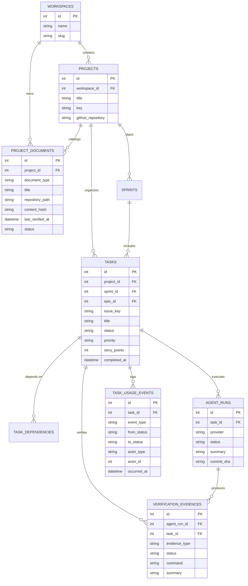

---

## 6. Comprehensive Traceability Matrix (Ma Trận Truy Vết Toàn Diện)

| Function ID | Tên Đặc Tả Chức Năng | Phân Hệ | Task Key | File Mã Nguồn Đại Diện | Test Suite |
| :--- | :--- | :--- | :--- | :--- | :--- |
| **FN-WS-01** | Multi-Tenant Workspace Resolution | Multi-Tenancy | `TASK-WS-01` | [`WorkspaceContext.php`](file:///d:/Work/task-hub/apps/hub/app/Services/WorkspaceContext.php) | `SaasTenantIsolationTest.php` |
| **FN-WS-02** | Desktop Token Pairing & Scoping | Multi-Tenancy | `TASK-DESK-01` | [`DesktopPairingController.php`](file:///d:/Work/task-hub/apps/hub/app/Http/Controllers/DesktopPairingController.php) | `DesktopAgentRuntimeTest.test.ts` |
| **FN-TASK-01** | Work Items Hierarchy (Epic/Story/Task) | Work Items | `TASK-CORE-01` | [`ApiTaskController.php`](file:///d:/Work/task-hub/apps/hub/app/Http/Controllers/Api/ApiTaskController.php) | `TaskE2EHistoryAuditTest.test.ts` |
| **FN-TASK-02** | DAG Task Dependency Blocker | Work Items | `TASK-CORE-03` | [`Task.php`](file:///d:/Work/task-hub/apps/hub/app/Models/Task.php#L72) | `TaskE2EHistoryAuditTest.test.ts` |
| **FN-TASK-03** | Task State Machine & Transitions | Work Items | `TASK-CORE-02` | [`ApiTaskController.php`](file:///d:/Work/task-hub/apps/hub/app/Http/Controllers/Api/ApiTaskController.php#L161) | `UiButtonWorkflowE2ETest.test.ts` |
| **FN-DOC-01** | Manifest Registry Parsing | Knowledge Base | `TASK-DOC-01` | [`ProjectKnowledgeService.php`](file:///d:/Work/task-hub/apps/hub/app/Services/ProjectKnowledgeService.php) | `ProjectDocumentsWorkflowE2ETest.test.ts` |
| **FN-DOC-02** | 30-Day Staleness Detection Engine | Knowledge Base | `TASK-DOC-02` | [`ProjectDocument.php`](file:///d:/Work/task-hub/apps/hub/app/Models/ProjectDocument.php#L25) | `ProjectDocumentsPanelTest.test.ts` |
| **FN-DOC-03** | Preflight Context Pack Ingestion | Knowledge Base | `TASK-DOC-03` | [`TaskHubContextPackService.php`](file:///d:/Work/task-hub/apps/hub/app/Services/TaskHubContextPackService.php) | `TaskHubAgentWorkflowTest.php` |
| **FN-DESK-01** | Git Worktree Isolation | Desktop App | `TASK-DESK-02` | [`ControlCenter.vue`](file:///d:/Work/task-hub/apps/desktop/src/views/ControlCenter.vue#L75) | `roadmap_feasibility_challenge.test.ts` |
| **FN-DESK-02** | Multi-Tier Policy & Human Escalation | Desktop App | `TASK-DESK-03` | [`ControlCenter.vue`](file:///d:/Work/task-hub/apps/desktop/src/views/ControlCenter.vue#L90) | `UserInTheLoopE2E.test.ts` |
| **FN-DESK-03** | Instant User Action Feedback & SFX | Desktop App | `TASK-UX-01` | [`useActionFeedback.ts`](file:///d:/Work/task-hub/apps/desktop/src/composables/useActionFeedback.ts) | `ControlCenterActionFeedback.test.ts` |
| **FN-DESK-04** | Background Context Pack Prefetching | Desktop App | `TASK-PERF-01` | [`useContextPackCache.ts`](file:///d:/Work/task-hub/apps/desktop/src/composables/useContextPackCache.ts) | `useContextPackCache.test.ts` |
| **FN-DESK-05** | Bidirectional Follow-Up Stream | Desktop App | `TASK-DESK-04` | [`RunWorkspace.vue`](file:///d:/Work/task-hub/apps/desktop/src/components/control-center/RunWorkspace.vue) | `UserInTheLoopE2E.test.ts` |
| **FN-HAND-01** | Strict JSON Schema Handoff Contract | Review Flow | `TASK-HAND-01` | [`agent-handoff.schema.json`](file:///d:/Work/task-hub/packages/contracts/schemas/agent-handoff.schema.json) | `diffHandoff.test.ts` |
| **FN-HAND-02** | Evidence Storage & Review Transition | Review Flow | `TASK-HAND-02` | [`ApiAgentRunController.php`](file:///d:/Work/task-hub/apps/hub/app/Http/Controllers/Api/ApiAgentRunController.php) | `testEvidence.test.ts` |
| **FN-HAND-03** | Reviewer Approval / Request Changes | Review Flow | `TASK-HAND-03` | [`ApiTaskController.php`](file:///d:/Work/task-hub/apps/hub/app/Http/Controllers/Api/ApiTaskController.php#L161) | `UserInTheLoopE2ETest.test.ts` |
| **FN-AUDIT-01**| E2E History Aggregation Service | Audit Trail | `TASK-AUDIT-01` | [`TaskHistoryService.php`](file:///d:/Work/task-hub/apps/hub/app/Services/TaskHistoryService.php) | `TaskE2EHistoryAuditTest.test.ts` |
| **FN-AUDIT-02**| Multi-Type Actor Attribution | Audit Trail | `TASK-AUDIT-02` | [`TaskHistoryTimeline.vue`](file:///d:/Work/task-hub/apps/hub/resources/js/Components/tasks/TaskHistoryTimeline.vue) | `TaskE2EHistoryAuditTest.test.ts` |
| **FN-AUDIT-03**| 1-Click Markdown Audit Report Export | Audit Trail | `TASK-AUDIT-03` | [`TaskHistoryTimeline.vue`](file:///d:/Work/task-hub/apps/hub/resources/js/Components/tasks/TaskHistoryTimeline.vue#L165) | `TaskE2EHistoryAuditTest.test.ts` |
| **FN-REQ-01** | AI Codebase & Docs Discovery | Requirement AI | `TASK-REQ-01` | [`discoveryPlan.ts`](file:///d:/Work/task-hub/apps/desktop/src/utils/discoveryPlan.ts) | `discoveryPlan.test.ts` |
| **FN-REQ-02** | Local Backlog Proposal Revision Loop | Requirement AI | `TASK-REQ-02` | [`WorkflowPanel.vue`](file:///d:/Work/task-hub/apps/desktop/src/components/control-center/WorkflowPanel.vue) | `WorkflowPanelReview.test.ts` |
| **FN-MCP-01** | 9 Standard MCP Server Tools | MCP Server | `TASK-MCP-01` | [`TaskHubMcpController.php`](file:///d:/Work/task-hub/apps/hub/app/Http/Controllers/Api/TaskHubMcpController.php) | `UserInTheLoopE2ETest.test.ts` |
| **NFR-01** | Secret Redaction & Token Masking | Security | `TASK-SEC-01` | [`redaction.ts`](file:///d:/Work/task-hub/apps/runner/src/redaction.ts) | Node Test Suite |
| **NFR-02** | Guardrails & 15-Min Fail-Closed | Security | `TASK-SEC-02` | [`safetyGuardrails.ts`](file:///d:/Work/task-hub/apps/desktop/src/utils/safetyGuardrails.ts) | `safetyGuardrails.test.ts` |

---

## 7. Verification Summary & Test Coverage

Mọi mục Functional và Non-Functional trong tài liệu này đều được kiểm chứng tự động qua **808 Unit, Component, Integration và E2E tests** (100% pass):
- **Web Hub API & Frontend**: 630 tests.
- **Desktop Control Center**: 176 tests.
- **Headless Runner**: 2 tests.
