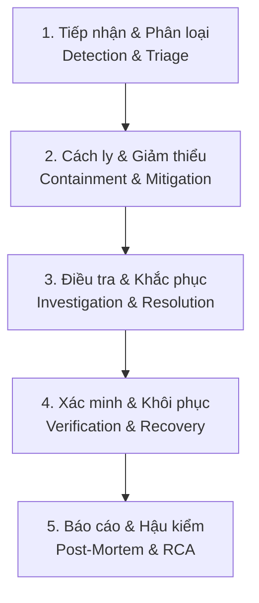

# Task Hub Incident Response & Troubleshooting Process

<!-- task-hub:incident-response:v1 -->

As-of commit: `ed247be11f5f7de7870c50a8c98306498e1278af`  
As-of date: 2026-08-21  
Document Version: 1.0.0  
Owner: Core Engineering & Operations  

---

## 1. Mục đích & Phạm vi (Purpose & Scope)

Tài liệu này quy định quy trình chuẩn để phát hiện, cách ly, xử lý, xác minh và tài liệu hóa khi xảy ra sự cố (Incident Response Lifecycle) trên toàn bộ hệ thống **Task Hub**, bao gồm:
- **Task Hub Web SaaS & API** (Laravel, Inertia Vue, PostgreSQL, Redis, Queues, Scheduler).
- **Desktop Agent Companion** (Electron, Vue 3, Local Git Worktree, IPC Bridge).
- **AI Agent Execution Engine** (Codex, Claude Code, Antigravity, Headless Runner).
- **Tích hợp Bên ngoài & Quota** (GitHub Webhooks, MCP Servers, Model Providers Quota & Rate limits).

---

## 2. Phân loại Mức độ Sự cố (Incident Severity Matrix)

| Mức độ (Severity) | Định nghĩa & Tiêu chí | Thời gian phản hồi (SLA) | Người chịu trách nhiệm |
| :--- | :--- | :--- | :--- |
| **P0 — Critical (Khẩn cấp)** | Toàn bộ Web Hub sập, mất mát dữ liệu, rò rỉ token/secret, hoặc Agent chạy phá hủy dữ liệu mã nguồn. | < 15 phút | Tech Lead + DevOps + Security |
| **P1 — High (Nghiêm trọng)** | Agent không thể nhận task, Webhook GitHub đứt kết nối, lỗi Pairing giữa Desktop và Hub, hỏng pipeline CI/CD. | < 1 giờ | Core Backend / Desktop Lead |
| **P2 — Medium (Trung bình)** | Một model AI bị lỗi rate limit (429), sync Quota bị trễ, giao diện hiển thị sai trạng thái không ảnh hưởng core workflow. | < 4 giờ | Feature Developer |
| **P3 — Low (Nhẹ)** | Lỗi giao diện nhỏ (UI glitch), log format chưa tối ưu, các cảnh báo warning không gây lỗi logic. | Trong sprint tới | QA / Frontend Developer |

---

## 3. Quy trình 5 Bước Xử lý Sự cố (5-Stage Incident Lifecycle)



### Bước 1: Tiếp nhận & Phân loại (Detection & Triage)
1. **Nguồn cảnh báo**:
   - Healthcheck `/up` hoặc endpoint `/api/v1/capabilities` trả về status khác 200.
   - Sentry / Error logs trong Laravel (`storage/logs/laravel.log`) hoặc Supervisor workers.
   - Desktop App thông báo `status === 'failed'` kèm exit code hoặc disconnect IPC.
2. **Ghi nhận sự cố**:
   - Xác định mức độ (P0 / P1 / P2 / P3).
   - Chỉ định **Incident Commander (IC)** chịu trách nhiệm điều phối.

### Bước 2: Cách ly & Giảm thiểu tức thì (Containment & Mitigation)
- **Nếu Agent chạy ngoài tầm kiểm soát**:
  - Gọi IPC `agent-stop` hoặc lệnh hủy `POST /api/agent-runs/{id}/cancel`.
  - Hủy worktree tạm: `.task-companion/hooks` hoặc dọn dẹp worktree isolation.
- **Nếu lỗi do bản phát hành mới (Bad Deployment)**:
  - Áp dụng Rollback Runbook (`docs/RELEASE_RUNBOOK.md`): chuyển traffic về release ổn định trước đó.
- **Nếu cạn Quota / Bị Rate Limit (429)**:
  - Tự động chuyển đổi Model dự phòng (Fallback Model) hoặc kích hoạt `Enable AI Credit Overages`.

### Bước 3: Điều tra & Khắc phục (Investigation & Resolution)
1. Bóc tách log chi tiết:
   - Desktop Logs: `userData/task-companion/logs/agent-<sessionId>.log`.
   - Hub Logs: `storage/logs/laravel.log` và bảng `agent_run_logs`.
2. Tái hiện lỗi trên môi trường kiểm thử cô lập (Isolated Test Branch).
3. Thực hiện sửa đổi mã nguồn (Code Fix) và kiểm tra không gây hồi quy (No Regression).

### Bước 4: Xác minh & Khôi phục (Verification & Recovery)
1. **Chạy bộ kiểm thử tự động toàn diện**:
   ```bash
   npm run desktop:typecheck
   npm run desktop:build
   npm run runner:test
   npm --workspace apps/hub test
   ```
2. **Kiểm tra Smoke Check**:
   - Endpoint `/up` và `/api/agent/models`, `/api/agent/quota`.
   - Chạy 1 Agent test run thử nghiệm và xác nhận `VerificationEvidence` được ghi nhận chính xác.

### Bước 5: Đóng sự cố & Tạo Tài liệu Hậu kiểm (Post-Mortem & RCA)
- Đối với mọi sự cố **P0** và **P1**, bắt buộc phải hoàn thành **Bản phân tích nguyên nhân gốc rễ (RCA)** trong vòng 24 giờ sau khi khôi phục.

---

## 4. Biểu mẫu Chuẩn khi Xử lý Sự cố (Standard Artifact Templates)

### 4.1. Mẫu Báo cáo RCA (Root Cause Analysis)

```markdown
# [RCA] Báo cáo Sự cố: <Tên sự cố>

- **Mã sự cố**: INC-YYYYMMDD-XX
- **Mức độ**: P0 / P1 / P2
- **Thời gian xảy ra**: YYYY-MM-DD HH:mm (UTC+7)
- **Thời gian khắc phục**: YYYY-MM-DD HH:mm (UTC+7)
- **Thời gian gián đoạn (Downtime)**: XX phút
- **Người phụ trách**: @username

---

### 1. Tóm tắt sự cố (Summary & Impact)
Mô tả ngắn gọn điều gì đã xảy ra, các dịch vụ và người dùng bị ảnh hưởng.

### 2. Dòng thời gian chi tiết (Incident Timeline)
- `HH:mm` — Phát hiện cảnh báo từ hệ thống.
- `HH:mm` — Incident Commander tiếp nhận và phân loại P1.
- `HH:mm` — Áp dụng giải pháp giảm thiểu tạm thời (mitigation).
- `HH:mm` — Hoàn thành bản vá nóng (hotfix) và kiểm thử pass 100%.
- `HH:mm` — Deploy bản vá và xác nhận hệ thống hoạt động ổn định.

### 3. Phân tích Nguyên nhân Gốc rễ (5 Whys Root Cause Analysis)
1. *Tại sao...?* → Trả lời: ...
2. *Tại sao...?* → Trả lời: ...
3. *Tại sao...?* → Trả lời: ...
4. *Tại sao...?* → Trả lời: ...
5. *Tại sao...?* → Trả lời: (Nguyên nhân cốt lõi).

### 4. Giải pháp đã thực hiện (Corrective Actions Taken)
- Mô tả các thay đổi mã nguồn, cấu hình hoặc hạ tầng đã triển khai.

### 5. Hành động phòng ngừa lâu dài (Preventative Action Items)
- [ ] Bổ sung test case tự động vào test suite.
- [ ] Cập nhật alert threshold trên hệ thống giám sát.
- [ ] Cập nhật tài liệu Runbook liên quan.
```

### 4.2. Mẫu Báo lỗi Bug Report

```markdown
### 🐛 [Bug]: <Tiêu đề lỗi>

- **Module**: Desktop App / Hub Web / Agent Runtime / API
- **Môi trường**: OS: Windows / macOS, Node version, Commit SHA

**Các bước tái hiện**:
1. ...
2. ...

**Kết quả thực tế**:
- Mô tả điều đã xảy ra kèm log / stacktrace.

**Kết quả mong đợi**:
- Mô tả hành vi đúng của hệ thống.
```

---

## 5. Cẩm nang Khắc phục Nhanh các Lỗi Phổ biến (Common Runbook)

### 5.1. Agent bị Treo hoặc Timeout (Stall / Hang)
1. Mở **Agent Workspace** trên Desktop App.
2. Bấm nút **🛑 Dừng** (Stop).
3. Nếu tiến trình hệ thống chưa tắt, mở Task Manager / Activity Monitor để kill tiến trình `codex`, `claude` hoặc `agy`.
4. Bấm **📜 Mở Log** để trích xuất file log lỗi gửi cho team kỹ thuật.

### 5.2. Quota AI Hết hạn hoặc Bị Rate Limit (HTTP 429)
1. Mở modal **⚡ Models & Usage** từ Header bar.
2. Kiểm tra chỉ số `% Quota 5-Hour` và `% Quota Weekly`.
3. Bật công tắc **`Enable AI Credit Overages`** hoặc chuyển sang model có hạn mức cao hơn (vd: chuyển từ `o3-pro` sang `gpt-5.6-terra` hoặc `gemini-3.7-flash`).

### 5.3. Xung đột Mã nguồn khi Pull (Git Merge Conflict)
1. Kiểm tra trạng thái: `git status`
2. Nếu có thay đổi chưa commit: `git stash save "temp-work"`
3. Kéo mã nguồn mới nhất: `git pull origin main`
4. Áp dụng lại thay đổi: `git stash pop`
5. Chạy lại test suite để đảm bảo không gãy tính năng: `npm --workspace apps/hub test`
